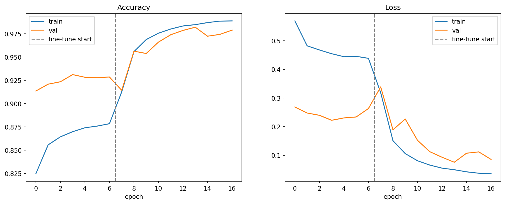
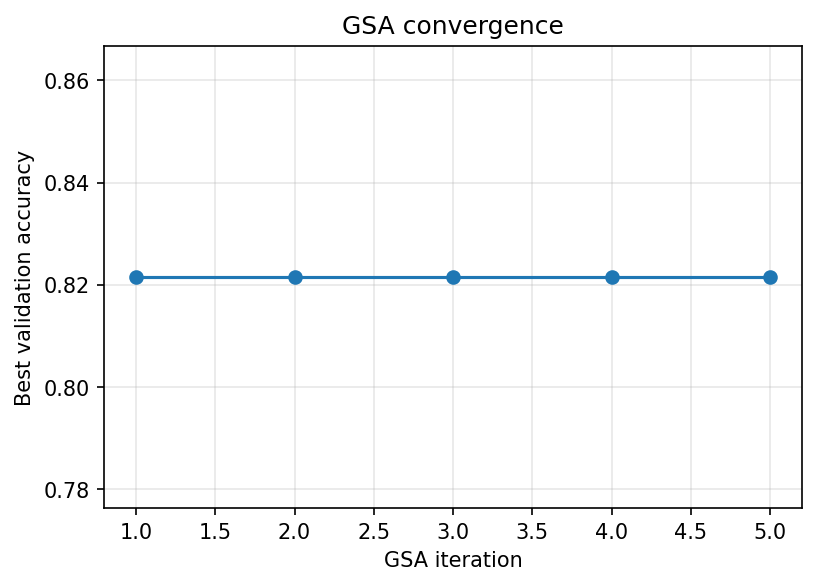
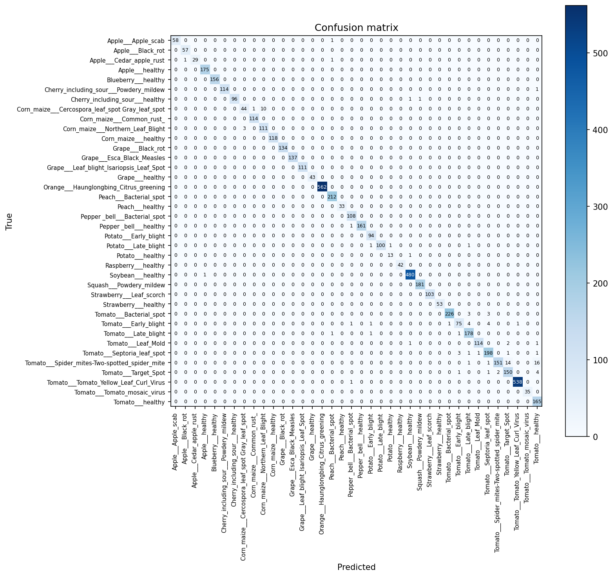

# 🌿 Deep Transfer Learning with GSA for Plant Disease Classification

**Plant-leaf disease classification combining transfer learning (MobileNetV2) with a
Gravitational Search Algorithm (GSA) for hyperparameter tuning.**

-F9AB00)

[About](#about) &nbsp;·&nbsp; [Getting Started](#getting-started) &nbsp;·&nbsp; [Notebook Flow](#notebook-flow) &nbsp;·&nbsp; [Sources](#acknowledgements--sources)

---

## Table of Contents

- [About](#about)
  - [Features](#features)
  - [Built With](#built-with)
- [Getting Started](#getting-started)
  - [Prerequisites](#prerequisites)
  - [Running It](#running-it)
- [Notebook Flow](#notebook-flow)
- [Key Functions](#key-functions)
- [How the GSA Works](#how-the-gsa-works)
- [Results](#results)
- [Caveats](#caveats)
- [Acknowledgements & Sources](#acknowledgements--sources)

## About

A single **Google Colab notebook** ([`training_model.ipynb`](training_model.ipynb)) that
classifies plant-leaf diseases. It is a **rebuilt version** that actually does what the title
claims — a genuine GSA optimizer and honest test metrics — replacing an earlier notebook that
fabricated its accuracy (an `accuracy × 2` metric).

### Features

- **Task:** image classification of plant diseases.
- **Dataset:** PlantVillage only (the coffee-leaf class is explicitly excluded), pulled from
  **Roboflow** in `"folder"` format (`train/`, `valid/`, `test/` class subfolders).
- **Model:** pretrained **MobileNetV2** ImageNet backbone, top removed, with a new classifier
  head; two-phase training (frozen head → fine-tune top of backbone).
- **Tuning:** a real **GSA** optimizing learning rate, dropout, and dense-layer width by
  validation accuracy.
- **Evaluation:** accuracy, per-class precision/recall/F1, and a confusion matrix on a
  held-out test set.

### Built With

- [TensorFlow](https://www.tensorflow.org/) / Keras, [NumPy](https://numpy.org/),
  [matplotlib](https://matplotlib.org/), [scikit-learn](https://scikit-learn.org/)
- [Roboflow](https://roboflow.com/) Python SDK for dataset download
- [Google Colab](https://colab.research.google.com/) (GPU runtime)

## Getting Started

### Prerequisites

- A Google account with **Colab** access and a **GPU** runtime
  (`Runtime → Change runtime type → GPU`).
- A [Roboflow](https://roboflow.com/) account and API key for the dataset.

### Running It

1. Open `training_model.ipynb` in Colab and select a **GPU** runtime.
2. Add a Colab secret named **`ROBOFLOW_API_KEY`** (🔑 panel) and enable notebook access.
3. Confirm the Roboflow `workspace` / `project` / `version` (Section 2) match your dataset.
4. Run all cells top to bottom. The final model is saved to
   `plant_disease_mobilenetv2_gsa.keras`.
5. The results (plots, CSV and JSON files) are written to `training_stats/`. In Colab, the
   folder is zipped and downloaded to your computer. The run reported below is kept in
   [`results/`](results/).

## Notebook Flow

| Section | What it does |
|---------|--------------|
| 1. Configuration | Image size, batch size, epoch counts, GSA search budget |
| 2. Download dataset | Roboflow pull; API key from **Colab Secrets** (`ROBOFLOW_API_KEY`) |
| 3. Load splits | Loads `train/valid/test`; carves a test set from val if none exists |
| — Guard | Three asserts: the same class set (in the same order) across all splits, no malformed class-folder names, and PlantVillage-only classes (rejects coffee/other) |
| 4. Input pipeline | `shuffle` / `prefetch` for GPU throughput; train is **not** cached (the full set would need ~113 GB of RAM), valid and test are cached |
| 5. Model builder | MobileNetV2 + augmentation + rescaling + dropout/dense head |
| 6. GSA | Metaheuristic search over `[0,1]^3`, decoded to real hyperparameters |
| 7. Run search | Searches on a **cached** training subset (every candidate sees identical data) + full val; reports best config |
| 8. Final training | Phase 1 (frozen head) → Phase 2 (fine-tune) with EarlyStopping |
| 9. Evaluation | Test accuracy, `classification_report`, confusion matrix |
| 10. Save | Exports `plant_disease_mobilenetv2_gsa.keras` |
| 11. Save statistics | Writes plots and CSV/JSON results to `training_stats/`; in Colab the folder is zipped and downloaded |

## Key Functions

| Function | Purpose |
|----------|---------|
| `load_split(name, shuffle)` | Load a `train`/`valid`/`test` directory into a `tf.data.Dataset` |
| `build_model(num_classes, dense_units, dropout_rate, learning_rate)` | Assemble + compile the MobileNetV2 transfer-learning model; returns `(model, base)` |
| `decode(pos)` | Map a GSA position in `[0,1]^3` to `(learning_rate, dropout, dense_units)` |
| `fitness(pos, train_ds, val_ds, epochs)` | Train a candidate and return `1 − last-epoch val_accuracy` (to minimize) |
| `gsa(train_ds, val_ds, ...)` | Full Gravitational Search Algorithm; returns best position, fitness, and convergence history |

## How the GSA Works

Each agent is a candidate hyperparameter vector. Per iteration it (1) evaluates fitness
(`1 −` last-epoch validation accuracy, measured on a **fixed, cached** training subset so all
candidates are compared on the same data), (2) assigns **masses** (better solutions heavier),
(3) computes **gravitational force** from the *kbest* heaviest agents with a decaying
gravitational constant `G(t)`, and (4) derives acceleration → velocity → new position. `kbest`
shrinks from all agents to 1, shifting from exploration to exploitation — following
Rashedi et al. (2009); see [Sources](#acknowledgements--sources).

## Results

One run on 2026-10-08 on a Colab GPU, with the Roboflow dataset
[`villagedata/plantvillage-8dgn3`](https://universe.roboflow.com/villagedata/plantvillage-8dgn3) version 2. All files are in [`results/`](results/).

| Metric | Value |
|--------|-------|
| Test images / classes | 5,568 / 38 |
| Test accuracy | 0.9822 |
| Test loss | 0.064 |
| Macro F1 | 0.977 |
| Misclassified test images | 99 |
| Training epochs | 7 head + 10 fine-tune |
| Best validation accuracy | 0.982 (epoch 14) |

**GSA best hyperparameters:** learning rate 0.00248, dropout 0.238, dense units 501. The
validation accuracy during the search was 0.8215, and it did not change across all 5 iterations.

**Weakest classes (lowest recall) and their main confusions:**

| Class | Recall | Main confusions (test images) |
|-------|--------|-------------------------------|
| Corn Cercospora / Gray leaf spot | 0.80 | Northern Leaf Blight (10) |
| Tomato spider mites | 0.83 | Tomato healthy (16), Target Spot (14) |
| Tomato early blight | 0.86 | Late blight (4), Septoria leaf spot (4) |

## Caveats

- **Roboflow config required.** The `workspace`/`project`/`version` and API key must be set;
  the notebook does not run unattended without them.
- **Colab-oriented.** Uses `google.colab.userdata` and `!pip install`; running outside Colab
  needs the secret handling and dataset download adapted.
- **Small search budget by default.** `GSA_AGENTS=5`, `GSA_ITERS=5`, `GSA_EVAL_EPOCHS=3`, and a
  60-batch training subset are tuned to finish quickly on Colab — raise them for better tuning.
- **Fallback test split.** If the export has no `test/` folder, the test set is carved from
  validation, so those metrics are less independent.
- **Reproducibility.** `tf.keras.utils.set_random_seed(SEED)` seeds TensorFlow (weight init,
  dropout, augmentation), NumPy, and Python at startup, so runs are far more comparable — but
  full determinism on GPU is still not guaranteed.
- **GSA gain unproven.** In the reported run, the GSA convergence was flat (0.8215 in all 5
  iterations), and there is no baseline run without GSA, so any GSA gain is unproven.
- **Fine-tune hit its cap.** The fine-tune phase stopped at the 10-epoch cap, not by EarlyStopping.
- **Class imbalance.** The test set has 14 to 562 images per class, so per-class metrics vary in
  reliability.
- **Lab imagery.** PlantVillage photos are taken in lab conditions, so accuracy on field photos
  will be lower.

## Acknowledgements & Sources

- **README template** — [Amazing GitHub Template](https://github.com/dec0dOS/amazing-github-template)
  by **dec0dOS**, via [awesome-readme](https://github.com/matiassingers/awesome-readme) (**Matias Singers**).
- **Gravitational Search Algorithm** — Rashedi, E., Nezamabadi-pour, H., & Saryazdi, S. (2009).
  *GSA: A Gravitational Search Algorithm.* Information Sciences, 179(13), 2232–2248.
  <https://doi.org/10.1016/j.ins.2009.03.004>
- **MobileNetV2** — Sandler, M., Howard, A., Zhu, M., Zhmoginov, A., & Chen, L.-C. (2018).
  *MobileNetV2: Inverted Residuals and Linear Bottlenecks.* CVPR. arXiv:1801.04381.
- **PlantVillage dataset** — Hughes, D. P., & Salathé, M. (2015). *An open access repository of
  images on plant health to enable the development of mobile disease diagnostics.* arXiv:1511.08060.
  See also Mohanty, S. P., Hughes, D. P., & Salathé, M. (2016), *Using Deep Learning for
  Image-Based Plant Disease Detection*, Frontiers in Plant Science, 7, 1419.
- **Dataset source** — [PlantVillage on Roboflow Universe](https://universe.roboflow.com/villagedata/plantvillage-8dgn3)
  (workspace `villagedata`, project `plantvillage-8dgn3`), version 2.
- **Frameworks** — [TensorFlow](https://www.tensorflow.org/)/Keras and
  [scikit-learn](https://scikit-learn.org/) for metrics.
